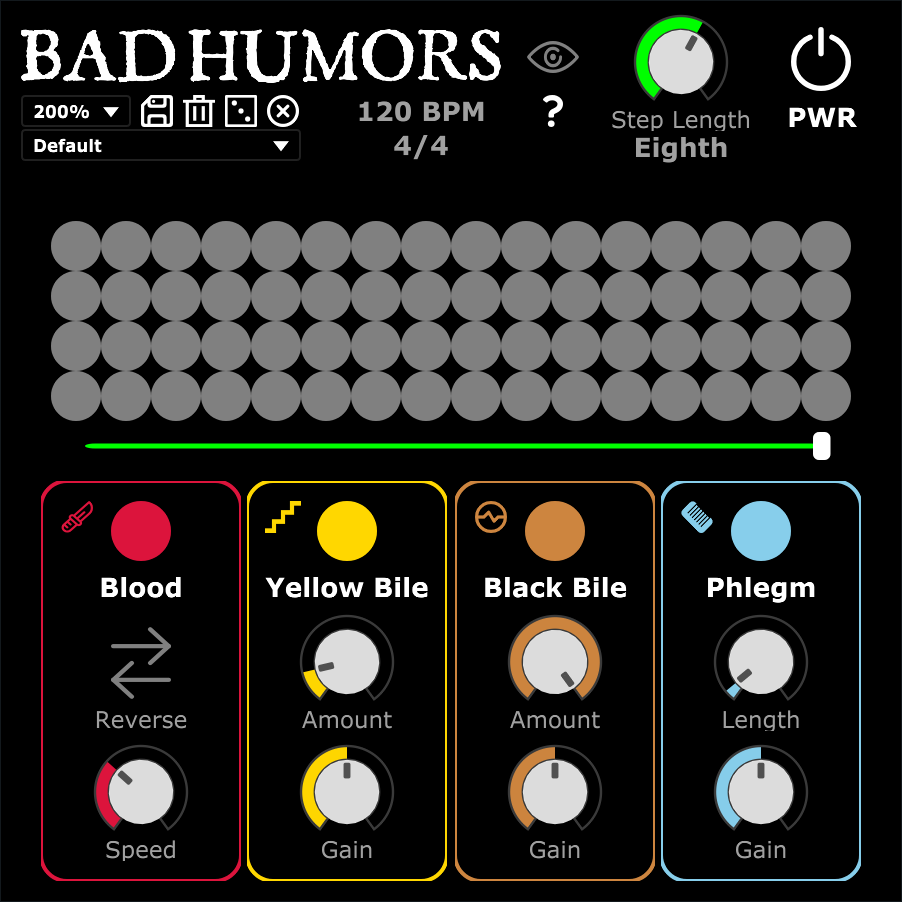

# Bad Humors
## A free, open-source effect sequencing VST/VST3/AU plugin for Windows, MacOS, and GNU/Linux
Made by [Circuitdust](https://www.youtube.com/@circuitduster)

Created with [Cabbage Audio](https://cabbageaudio.com/) 2.9.0 and [CSound](https://csound.com/index.html) 6.18.0

## Gist
The purpose of this plugin is to give you some creative effects to use in one place, or to spice up your rhythm with some glitchiness.

The effect plugin syncs with your DAW to let you sequence 4 effects, from 1 to 16 steps.

The steps have one length that you can designate from one whole note to one 32nd note, based on your BPM.

The effects can be combined together and are chained left-to-right (or top-to-bottom).

### THE GRID
The way you enable these effects is by clicking the buttons in the 4 by 16 grid sequencer.

When you press play in your DAW, the grid is read left-to-right, indicated by a green light above the grid sequencer.

There is a green slider below the grid sequencer that you can adjust from 1 to 16 steps.

The slider is useful for sequencing in a multitude of time signatures, or simply having one step that always keeps the effects on.

### Step Length / Speed
You can adjust how the fast the grid sequencer is read by adjusting the step length.

The steps can either be whole notes, half notes, quarter notes, eighth notes, 16th notes, or 32nd notes.

### Effect 1: Blood (Slicer)
This slicer takes your audio input and repeats it in a loop. This utilizes Rory Walsh's [audio splicer opcode](https://forum.cabbageaudio.com/t/audio-retrigger-effect-in-csound/3937/3) from the Cabbage Audio forums.

You can press "Reverse" to reverse the audio output from the slicer.

You can increase the speed of the slicing, based on your BPM.

### Effect 2: Yellow Bile (Bitcrusher)
This bitcrusher takes the audio input and downsamples it, based on the number of folds you specify.

You can tweak the number of folds from 1 (no effect) to 250 (absurd amount).

You can also adjust the gain of the output.

### Effect 3: Black Bile (Distortion)
This distortion takes the audio input and waveshapes it to a sigmoid waveform.

You can adjust the amount of distortion, from no distortion to complete distortion.

You can also adjust the gain of the output.

### Effect 4: Phlegm (Reverb)
This comb reverb takes the audio input and passes reverberation through a comb filter at 0.05 seconds.

You can adjust the length of the reverb, which is the number of seconds multiplied by your BPM.

You can also adjust the gain of the output (highly recommended, it gets loud).

### Randomization
Instead of creating your own sequences, you can create pseudo-random sequences for your creative needs.

Click the six-sided die "randomize" icon to clear the grid sequencer and generate a new pattern.

You can also click the "clear" icon to simply clear the grid sequencer.

### Presets
You can load the default presets and save your own presets.

The dropdown box lets you select the presets located in the "BadHumors.snaps" file.

Click the floppy disk "save" icon to name your preset and save it to "BadHumors.snaps" for later use or sharing.

Click the trash can "delete" icon to confirm and delete the currently selected preset in the dropdown box.

To restore the default presets, you can redownload the "BadHumors.snaps" file where they are stored.

Any "snaps" file in the same directory as the plugin will be loaded into the preset list, so you can export your presets to another file to avoid losing them when modifying the default "BadHumors.snaps" file.

### Miscellaneous
There is a power button to toggle the plugin's functionality, basic resizing of the UI, an eye button that you can click to toggle the effect names and their types, and a help button that redirects you to this GitHub repository.

## How to Install
You will need to install [CSound](https://csound.com/index.html) to run this plugin. This plugin is also 64-bit only.
1. Download the compressed ZIP file from [Releases](https://github.com/niflheimmer/badhumors/releases) for your operating system and plugin type.
2. Download and install [CSound](https://csound.com/index.html) to the default directory and choose to create a PATH environment variable if specified (important on Windows!)
3. Copy the needed files following your operating system below:
- **For Windows**, copy the "BadHumors" folder that contains the ".dll" VST or ".vst3" VST3 plugin file, "BadHumors.csd", the "images" folder, and the "BadHumors.snaps" preset file into your plugin directory:
	- VST: C:\Program Files\Common Files\VST 2
	- VST3: C:\Program Files\Common Files\VST3
- **For MacOS**, copy the ".component" AU package or ".vst3" VST3 package into your plugin directory:
	- AU: /Library/Audio/Plug-Ins/Components/
	- VST3: /Library/Audio/Plug-Ins/VST3
- **For GNU/Linux**, copy the "BadHumors" folder that contains the ".so" VST plugin file, "BadHumors.csd", the "images" folder, and the "BadHumors.snaps" preset file into your plugin directory:
	- VST: /home/yourusername/.vst

## How to Build
You will need to install [Cabbage Audio](https://cabbageaudio.com/) and [CSound](https://csound.com/index.html) to build this plugin. Cabbage also requires CSound and allows you to install both requirements on Windows & MacOS.
1. Download and install [Cabbage Audio](https://cabbageaudio.com/) and choose to install CSound as well if possible (highly recommended).
2. Download the source code files from this GitHub repository to a convenient folder.
3. Open Cabbage Audio, select "File", select "Open Csound file", and navigate to "BadHumors.csd" and select it.
4. Select "File", select "Export plugin", and export it as the plugin effect format of your choice (do not select "Plugin Synth").
5. Name the plugin file "BadHumors" or a name of your choosing. The files are now ready to be installed.

## Bad "Humors"?
The theme of the plugin is based on [humorism / humoralism](https://en.wikipedia.org/wiki/Humorism).

## Like this plugin? Used it?
Please let me know, I would love to hear what you created with this!

## Want to contribute?
You can clone this GitHub repository and send me your changes & additions.

This plugin's code is licensed under GPLv2.

## Credits:
- Rory Walsh: creator of [Cabbage Audio](https://cabbageaudio.com/), who also created the [audio splicer opcode](https://forum.cabbageaudio.com/t/audio-retrigger-effect-in-csound/3937/3)
	- Thank you for helping me through most of the development, I wouldn't have been able to do this without you.
- The people from the Deep End discord server who supported this release
	- Thank you grrdjf, ARKAN, dreamer, and ariel & duck for your suggestions and help!
- The people responsible for [CSound](https://csound.com/index.html)
- Public domain icons in UI: [SVG Repo](https://www.svgrepo.com/)
- Title font in UI: JSL Ancient